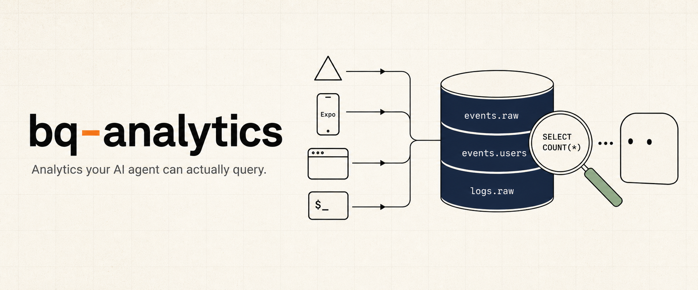
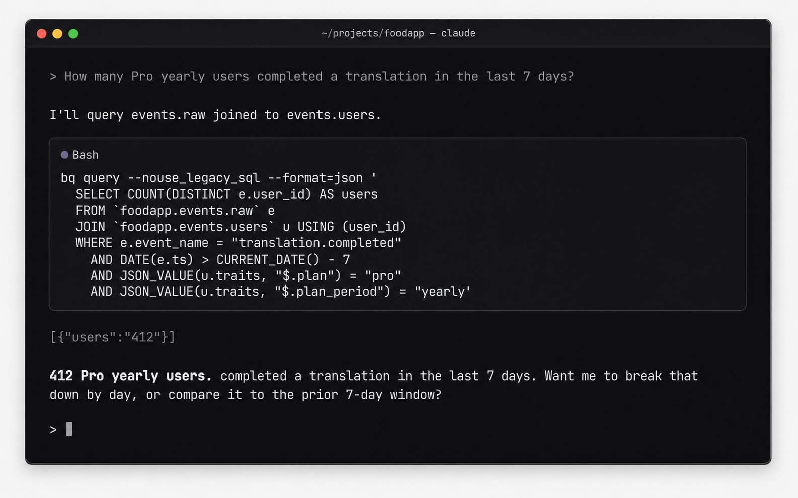

<p align="center">
  
</p>

**bq-analytics** is a tiny analytics SDK that pipes events directly to BigQuery — so your AI agent can answer "how is the product doing?" by querying real data, not eyeballing a dashboard.

```sh
pnpm add bq-analytics
```

## Capabilities

- **AI-native by design.** `bq query` is the interface. Claude / Cursor / any agent can read your real product data, run conversion funnels, and debug user issues — no hosted dashboard, no proprietary query language.
- **~$0/mo at indie scale.** 5M events/month fits inside BigQuery's free tiers. PostHog Cloud at the same volume is ~$153/mo. Your data lives in your own GCP project — migrate to ClickHouse / DuckDB / Tinybird with one `bq extract`.
- **One SDK, every runtime.** Next.js (Vercel), Express / Hono / Fastify, Expo / React Native, browser, Node CLI — same `track / identify / group / log / feedback` shape, same BigQuery schema.
- **No queue infra to run.** Browser and RN persist failed batches locally; Vercel Log Drain retries server logs at-least-once. Server-side `track()` durability matches PostHog / Segment / Amplitude — see the operations details below.
- **Feature flags + release config built in.** Edge Config-backed flags and Expo force-update / what's-new prompts ship in the same package. Exposures auto-track for impact analysis.
- **No service-account keys.** Vercel OIDC → GCP Workload Identity Federation. No JSON keys to rotate.

> **Tip:** once installed, ask your agent _"what can bq-analytics do?"_ — the bundled Claude skill walks it through.

<p align="center">
  
</p>

## Quickstart

The fastest path is via the Claude Code marketplace — Claude drives the install, detects your runtime, wires the route handlers, and tells you what to verify.

```
/plugin marketplace add johnkueh/claude-skills
/plugin install claude-skills@johnkueh-skills
/bq-analytics-install
```

<details>
<summary>Prefer to set it up manually?</summary>

```sh
pnpm add bq-analytics

# One-shot per project: BQ datasets + tables, Vercel OIDC, IAM bindings, log drain
TEAM_SLUG=acme PROJECT_NAME=my-app PROJECT_DOMAIN=www.example.com \
  VERCEL_TOKEN=... \
  ./node_modules/bq-analytics/scripts/setup-bq-oidc.sh --gcp my-gcp-project
```

Then in your Next.js app:

```ts
// src/app/api/track/route.ts
export { POST } from "bq-analytics/next/track-route";

// src/app/api/internal/log-drain/route.ts
export { POST } from "bq-analytics/next/log-drain-route";

// anywhere in server code
import { Analytics, bqTransport } from "bq-analytics";
const a = new Analytics({ transport: bqTransport({ projectId: "..." }) });
a.track("translation.started", { videoId: "abc" }, { userId: "u1" });
a.identify("u1", { plan: "pro", credits: 47 });
await a.flush();
```

</details>

## What you can ask your agent

Once `events.*` and `logs.*` are flowing, an AI agent can answer real product questions directly. Examples that map to a single BigQuery query:

| Question | Tables joined |
|---|---|
| "Funnel from signup to first purchase last 7 days, split by plan" | `events.raw` + `events.users` |
| "Which Pro yearly users hit upload errors today?" | `events.raw` + `events.users` + `logs.raw` |
| "What did this user see when they reported the bug?" | `events.feedback` + `events.raw` + `events.users` |
| "Did the new-checkout flag move conversion?" | `events.raw` (filtered on `$flag_called`) |
| "Show me the last 30 minutes of errors on the `/translate` route" | `logs.raw` |

The bundled [`claude-skills/query/SKILL.md`](claude-skills/query) gives agents prompt-shaped guidance for these joins. No dashboard, no SaaS billing — just SQL the agent already knows how to write.

## Modules

| Module | What it adds | Required? |
|---|---|---|
| `bq-analytics` | Core SDK — `track / identify / group / log / feedback` + `bqTransport` / `httpTransport` | ✅ |
| `bq-analytics/next` | Next.js route handlers (`/api/track`, log drain, flags, release config) | for Next |
| `bq-analytics/pino` | pino transport for Express / Fastify / Hono / raw Node | for non-Next |
| `bq-analytics/browser` | `browserTransport`, `attachBrowserAutoFlush`, `attachWindowErrorHandler` | for web |
| `bq-analytics/react-native` | `reactNativeTransport`, `attachExpoErrorHandler`, `attachAppStateFlush` | for RN/Expo |
| `bq-analytics/cli` | `attachCliHooks` — uncaught + unhandled + SIGINT/SIGTERM | for CLI |
| `bq-analytics/edge-config` + `bq-flags` | Feature flags + CLI | optional |
| `bq-analytics/release/native` | Force-update gate + what's-new + pending-update prompts for Expo | optional |

## Setup by stack

<details>
<summary><b>Next.js on Vercel</b></summary>

```ts
// src/app/api/track/route.ts
import { createTrackRoute } from "bq-analytics/next";
export const POST = createTrackRoute({
  projectId: process.env.GCP_PROJECT_ID!,
  resolveUser: async (req) => /* your auth lookup */ null,
});

// src/app/api/internal/log-drain/route.ts
import { createLogDrainRoute } from "bq-analytics/next";
export const POST = createLogDrainRoute({
  projectId: process.env.GCP_PROJECT_ID!,
  secret: process.env.LOG_DRAIN_SECRET!,
});

// src/lib/analytics.ts — server singleton
import { Analytics, bqTransport } from "bq-analytics";
declare global { var __bqa: Analytics | undefined; }
export function analytics() {
  return globalThis.__bqa ??= new Analytics({
    transport: bqTransport({ projectId: process.env.GCP_PROJECT_ID! }),
  });
}

// in any route handler
import { after } from "next/server";
analytics().track("foo", { ... }, { userId });
after(() => analytics().flush());
```

The setup script provisions the Vercel Log Drain pointed at `/api/internal/log-drain` automatically.

</details>

<details>
<summary><b>Express / Hono / Fastify / Koa / raw Node</b></summary>

```ts
import pino from "pino";
import { pinoBqTransport } from "bq-analytics/pino";
import { Analytics, bqTransport } from "bq-analytics";

const a = new Analytics({ transport: bqTransport({ projectId }) });
const logger = pino({}, pinoBqTransport({ projectId, analytics: a, source: "api" }));

// Express
import pinoHttp from "pino-http";
app.use(pinoHttp({ logger }));               // every request → logs.raw
app.post("/checkout", async (req, res) => {
  a.track("checkout.started", { plan: "pro" }, { userId: req.userId });
  res.json({ ok: true });
});

// Graceful shutdown — flush before SIGTERM kills you
process.on("SIGTERM", async () => { await a.flush(); process.exit(0); });
```

Hono uses the same pattern with `hono/logger`. Fastify accepts `logger` directly via `Fastify({ logger })`.

</details>

<details>
<summary><b>Browser</b></summary>

```ts
import { Analytics } from "bq-analytics";
import {
  browserTransport,
  attachBrowserAutoFlush,
  attachWindowErrorHandler,
} from "bq-analytics/browser";

const a = new Analytics({ transport: browserTransport({ url: "/api/track" }) });
attachBrowserAutoFlush(() => a.flush());   // flush on pagehide / visibilitychange
attachWindowErrorHandler(a);               // uncaught + unhandledrejection → logs.raw

a.track("page.viewed", { path: location.pathname });
```

</details>

<details>
<summary><b>Expo / React Native</b></summary>

```ts
import { Analytics } from "bq-analytics";
import {
  reactNativeTransport,
  attachExpoErrorHandler,
  attachAppStateFlush,
} from "bq-analytics/react-native";
import AsyncStorage from "@react-native-async-storage/async-storage";
import { AppState, Platform } from "react-native";

const a = new Analytics({
  transport: reactNativeTransport({
    url: `${API_URL}/api/track`,
    headers: { authorization: `Bearer ${deviceToken}` },
    storage: AsyncStorage,
  }),
});

// Pass attrs as a getter when userId loads asynchronously
let currentUserId: string | undefined;
attachExpoErrorHandler(a, ErrorUtils, () => ({ platform: Platform.OS, userId: currentUserId }));
attachAppStateFlush(a, AppState, () => ({ userId: currentUserId }));

a.track("import.started", { source: "instagram" }, { userId: currentUserId });
```

**Recommended `identify()` traits for Expo apps** — include `platform`, `app_version`, `build_number`, `ota_update_id`, `ota_channel`, `runtime_version`. The `ota_update_id` is the only honest answer to "but I OTA'd!". `events.users` is last-write-wins, so the next OTA's `identify` updates the row in place.

</details>

<details>
<summary><b>Node CLI / scripts</b></summary>

```ts
import { Analytics, bqTransport } from "bq-analytics";
import { attachCliHooks } from "bq-analytics/cli";

const a = new Analytics({ transport: bqTransport({ projectId }) });
attachCliHooks(a, { source: "my-cli" });   // uncaught + unhandled + SIGINT/SIGTERM

a.track("cli.command_run", { command: process.argv[2] });
await a.flush();   // CRITICAL: process exits the moment you return
```

If your CLI talks to a hosted product, swap `bqTransport` for `httpTransport` — same SDK, events go through `/api/track` with an API key.

</details>

<details>
<summary><b>Non-Node (Python, Go, Ruby)</b></summary>

There's no native SDK. POST events directly to your `/api/track` route from any HTTP client. The schema is `{ records: [{ kind: "event", row: {...} }, ...] }` — see [`src/types.ts`](src/types.ts) for the row shapes.

</details>

## Architecture

```
                                       BigQuery (your GCP project)
                                       ┌──────────────────────────┐
                                       │ events.raw                │
                                       │ events.identifies         │
browser SDK ─┐                         │ events.groups             │
RN/Expo SDK ─┼─ POST /api/track ──────▶│ events.user_groups        │
CLI scripts ─┘                         │   + views: events.users,  │
server SDK ─── direct insertAll ──────▶│           groups_current  │
                                       │                           │
Vercel Log ──── /api/internal/         │ logs.raw                  │
Drain          log-drain ─────────────▶│                           │
                                       └──────────────────────────┘
                                                 ▲
                                                 │  bq query  (CLI / Claude)
```

Two pipelines: **events.\*** (explicit product events from any client, JSON property column → never migrate) and **logs.\*** (implicit Vercel runtime captures via Log Drain — replaces Vercel's 1–3 day log retention with your BQ partition policy).

## Cost (5M events/month, indie scale)

| Component | $/month |
|---|---|
| BigQuery streaming ingest | $0 (under 2 TiB free tier) |
| BigQuery storage | ~$0.03 (60 GB active × $0.02/GiB) |
| BigQuery queries | $0 (under 1 TB free) |
| Vercel function — `/api/track` (5M × 10 ms) | ~$0.20 |
| Vercel function — drain handler (~5k batches × 50 ms) | ~$0.01 |
| Vercel Observability log overage | ~$0.13 (1.25 GB × $0.50/GiB after 1 GB free) |
| Vercel Log Drain delivery | $0 (Pro included) |
| **Total** | **~$0.40 / mo** |

PostHog Cloud at 5M: ~$153/mo. ~400× cheaper. Want PostHog's UI and replays? Use PostHog. Want event analytics + flags an AI agent can query and operate? This.

<details>
<summary><b>Schema</b></summary>

```sql
events.raw           event_id, ts, event_name, user_id, anonymous_id, session_id, properties JSON
events.identifies    ts, user_id, traits JSON
events.groups        ts, group_type, group_id, traits JSON
events.user_groups   ts, user_id, group_type, group_id

events.users               ── view: latest traits per user_id
events.groups_current      ── view: latest traits per (group_type, group_id)
events.user_groups_current ── view: most-recent group per user/type

events.feedback      feedback_id, ts, kind, subject, message, severity, url,
                     user_id, anonymous_id, session_id, properties JSON

logs.raw             ts, level, source, message, fields JSON, request_id, deployment_id, path, status, region, raw
```

All tables partition by `DATE(ts)` and cluster on common filter columns. Custom traits/properties go in `JSON` columns — never alter schema for a new field.

</details>

<details>
<summary><b>Querying — example BQ queries</b></summary>

```sh
# events
bq query --nouse_legacy_sql --format=json '
  SELECT event_name, COUNT(*) AS n
  FROM `proj.events.raw` WHERE DATE(ts) > CURRENT_DATE() - 7
  GROUP BY 1 ORDER BY n DESC'

# pro yearly users → translation.completed conversion
bq query --nouse_legacy_sql --format=json '
  SELECT COUNT(*) FROM `proj.events.raw` e
  JOIN `proj.events.users` u USING (user_id)
  WHERE e.event_name = "translation.completed"
    AND JSON_VALUE(u.traits, "$.plan") = "pro"
    AND JSON_VALUE(u.traits, "$.plan_period") = "yearly"'

# bug reports from pro users in the last week
bq query --nouse_legacy_sql --format=json '
  SELECT f.subject, f.message, JSON_VALUE(u.traits, "$.email") AS email
  FROM `proj.events.feedback` f
  LEFT JOIN `proj.events.users` u USING (user_id)
  WHERE f.kind = "bug" AND DATE(f.ts) > CURRENT_DATE() - 7
    AND JSON_VALUE(u.traits, "$.plan") = "pro"
  ORDER BY f.ts DESC'

# replace `vercel logs --query`
bq query --nouse_legacy_sql --format=json '
  SELECT ts, level, path, status, message FROM `proj.logs.raw`
  WHERE ts > TIMESTAMP_SUB(CURRENT_TIMESTAMP(), INTERVAL 30 MINUTE)
    AND CONTAINS_SUBSTR(message, "beacon")
  ORDER BY ts DESC LIMIT 50'
```

</details>

<details>
<summary><b>Product feedback — bug reports / requests joinable to events</b></summary>

One method writes structured feedback into a dedicated `events.feedback` table — joinable with `events.users` and `events.raw` on `user_id`, so an agent has a single query for "this user said the upload broke; what was actually happening at that moment?"

```ts
analytics.feedback(
  {
    kind: "bug",                          // "bug" | "request" | "general" | (custom)
    subject: "Translate button does nothing",
    message: "After uploading a video, the Translate button is unresponsive.",
    severity: "high",
    url: "/translate",
    properties: { app_version: "1.4.2", platform: "ios" },
  },
  { userId, sessionId },
);
```

Same intake as `track`/`identify`/`group` — buffered and flushed via the same lifecycle. Browser/RN submissions ride `/api/track`; server and CLI write direct via `bqTransport`. Anonymous submissions accepted (omit `userId`).

This is **intake + warehouse**, not a helpdesk. No inbox UI, no threading, no status mutation — those belong in Linear/Plain/Pylon. The point here is "Claude has the full story when investigating."

```sql
WITH f AS (
  SELECT * FROM `proj.events.feedback`
  WHERE DATE(ts) > CURRENT_DATE() - 7 AND kind = 'bug'
)
SELECT
  f.feedback_id, f.ts AS reported_at, f.subject, f.message,
  JSON_VALUE(u.traits, '$.plan')        AS plan,
  JSON_VALUE(u.traits, '$.app_version') AS app_version,
  ARRAY(
    SELECT AS STRUCT e.event_name, e.ts
    FROM `proj.events.raw` e
    WHERE e.user_id = f.user_id
      AND e.ts BETWEEN TIMESTAMP_SUB(f.ts, INTERVAL 30 MINUTE) AND f.ts
    ORDER BY e.ts DESC LIMIT 20
  ) AS recent_events
FROM f
LEFT JOIN `proj.events.users` u USING (user_id)
ORDER BY f.ts DESC LIMIT 50;
```

That single query gives an agent: the bug report, the user's plan + build, and the last 30 minutes of their session. No cross-system stitching.

</details>

<details>
<summary><b>Feature flags — Edge Config + bq-flags CLI</b></summary>

Backed by Vercel Edge Config; sub-second propagation; ~free at indie scale; exposures auto-track to `events.raw`.

```ts
// src/lib/flags.ts
import { Flags } from "bq-analytics";
import { edgeConfigSource } from "bq-analytics/edge-config";
import { analytics } from "./analytics";

export const flags = new Flags({
  source: edgeConfigSource(),
  analytics: analytics(),         // → emits "$flag_called" exposures
  refreshIntervalMs: 60_000,
});

await flags.ready();
if (flags.isOn("new-checkout", userId)) { /* new flow */ }
```

Browser/RN clients fetch via your own `/api/flags` route — never expose the Edge Config token to clients. The `bq-analytics/next/flags` subpath isolates the `@vercel/edge-config` import so `/api/track` stays edge-config-free.

```ts
// src/app/api/flags/route.ts
import { createFlagsRoute } from "bq-analytics/next/flags";
export const GET = createFlagsRoute({
  resolveUser: async (req) => /* your auth */ null,
  filter: (flags) => Object.fromEntries(
    Object.entries(flags).map(([k, v]) => [k, { ...v, users: undefined }]),
  ),
});

// browser / RN
import { Flags, httpSource } from "bq-analytics";
const flags = new Flags({ source: httpSource({ url: "/api/flags" }) });
await flags.ready();
flags.isOn("new-checkout", userId);
```

**One-time setup:** `./scripts/setup-edge-config.sh` provisions the store, mints a token, sets `EDGE_CONFIG` on Vercel Production, pulls into `.env.local`. Idempotent.

**Operating flags — `bq-flags` CLI:**

```sh
bq-flags list                                 # current state
bq-flags on  new-checkout --rollout 25%       # create / turn on at 25%
bq-flags rollout new-checkout 100%            # ramp
bq-flags allow ai-suggestions u_alice u_bob   # allowlist
bq-flags off new-checkout                     # kill switch
bq-flags eval new-checkout --outcome subscription.started
```

`eval` runs exposure / lift queries against `events.raw`. Full operations guide and cohort-materialisation flow in [`claude-skills/flags/SKILL.md`](claude-skills/flags/SKILL.md).

**Flag config shape** — one JSON object under the `flags` key in Edge Config:

```json
{
  "new-checkout":   { "on": true, "rollout": 0.5 },
  "ai-suggestions": { "on": true, "users": ["u_john", "u_beta1"] },
  "kill-old-flow":  { "on": false }
}
```

`rollout` is `0..1` (deterministic FNV-1a hash on `userId+key`). `users` allowlist bypasses the rollout.

</details>

<details>
<summary><b>Release config — force-update + what's-new for Expo apps</b></summary>

Server-driven release UX: force-update gate (hard block / soft nudge), post-update what's-new sheet, channel-aware store deeplinks. One opinionated Edge Config blob under the key `release`. Same store as flags is fine.

```ts
// src/app/api/release-config/route.ts (Next.js)
import { createReleaseConfigRoute } from "bq-analytics/next/release";
export const GET = createReleaseConfigRoute();
// Reads `release` from Edge Config, validates, returns JSON with 60s edge cache.
```

```tsx
// app/_layout.tsx — headless components, you provide UI via render props
import * as Updates from "expo-updates";
import Constants from "expo-constants";
import { UpdateGate, ReleaseNotesPrompt } from "bq-analytics/release/native";
// Optional — only import this if you want the auto-summoned "Update ready" sheet.
import { PendingUpdatePrompt } from "bq-analytics/release/native/pending-update";

const channel = Updates.channel || (__DEV__ ? "development" : "production");
const releaseTag =
  (Constants.expoConfig?.extra?.releaseTag as string | undefined) ??
  Constants.expoConfig?.version;

<UpdateGate
  iosAppId="123456789"
  androidPackage="com.example.app"
  channel={channel}
  renderHardBlock={({ message, openStore }) => (
    <YourForceUpdateScreen message={message} onUpdate={openStore} />
  )}
>
  <App />
  <ReleaseNotesPrompt
    iosAppId="123456789"
    androidPackage="com.example.app"
    channel={channel}
    appVersion={releaseTag}
    render={(ctx) => <YourWhatsNewSheet {...ctx} />}
  />
  <PendingUpdatePrompt
    render={(ctx) => <YourUpdateReadySheet {...ctx} />}
    silentReloadAfterBackgroundMs={120_000}
  />
</UpdateGate>
```

`ReleaseNotesPrompt` `ctx`: `{notes, verdict, visible, onDismiss, onUpdate, onCtaTap}`. Verdict (`'ok'` | `'soft'`) drives the primary CTA; `'hard'` never reaches the sheet (the gate replaces children). Optional `appVersion` prop suppresses the sheet until the user is on the bundle whose label matches `notes.version`.

`PendingUpdatePrompt` `ctx`: `{updateId, visible, onApply, onDismiss, applying}`. Auto-fires when an OTA bundle is downloaded but not yet applied; per-bundle dismissal stored in AsyncStorage. Skipped in `__DEV__` by default.

**Bundle discovery options:**
- Default: cold-start only via expo-updates' `checkAutomatically: 'ON_LOAD'`. Conservative — never interrupts foreground sessions but slow propagation.
- `silentReloadAfterBackgroundMs={120_000}`: when the app returns from background ≥ 2 min, silently `checkForUpdateAsync + fetchUpdateAsync + reloadAsync`. User perceives the return as a fresh open. Active foreground sessions are never interrupted. Cascade-safe via 60s `lastReloadedAt` cooldown. See [Expo's silent-reload guidance](https://docs.expo.dev/eas-update/download-updates/).

**One-time setup:**

```sh
./scripts/setup-edge-config.sh   # if you don't already have an Edge Config store
./scripts/setup-release.sh       # seeds the `release` key with the no-op default
```

**Operating release config — `bq-release` CLI:**

```sh
bq-release show                                   # current state
bq-release gate off                               # disable the gate
bq-release gate soft 42                           # nudge users below build 42
bq-release gate hard 42 --message "Critical fix"  # full-screen block
bq-release notes "v1.1.0" --from notes.json       # publish what's-new
bq-release clear-notes
bq-release urls set preview ios "itms-beta://..."
```

Read-merge-write semantics — partial updates don't blow away other fields. All write commands accept `--dry-run`. Full operations guide in [`claude-skills/release/SKILL.md`](claude-skills/release/SKILL.md).

**Telemetry events** — exported as `RELEASE_EVENTS` from `bq-analytics/release`:

```
update_gate.shown          update_gate.feedback_tapped
whats_new.shown            whats_new.dismissed       whats_new.update_tapped
whats_new.feedback_tapped  whats_new.cta_tapped
pending_update.shown       pending_update.applied    pending_update.dismissed
```

Cohorts slice by `app_version` / `build_number` / `runtime_version` traits on `identify`. Pending-update events carry `update_id` for per-bundle apply-rate analysis.

</details>

<details>
<summary><b>Operations — durability, auth, smoke tests, teardown</b></summary>

### Durability

| Pipeline | In-flight loss on function-termination | Destination (BQ) outage |
|---|---|---|
| Browser → `/api/track` | Recovered: failed batches persist to `localStorage`, retried on next page load | Same as in-flight |
| RN/Expo → `/api/track` | Recovered: failed batches persist to `AsyncStorage`, retried on next app launch | Same as in-flight |
| Server SDK → BQ direct | **Possible loss** if the function instance dies between buffered `track()` and next `flush()`. Mitigation: `flushAt: 1` or `await flush()` (or `after(() => flush())` on Vercel) | **Possible loss** — `/api/track` returns 5xx, no server-side queue |
| Vercel Log Drain → handler → BQ | At-least-once: Vercel retries on 5xx | At-least-once: same retry path |
| CLI scripts → `/api/track` | Script process owns retry | If `/api/track` returns 5xx, the call throws — script can retry |

**Server-side gap is identical to PostHog / Segment / Amplitude** — verified against their docs and source. None of them ship a Redis/disk durability layer in the SDK. Hosted tools' edge is that their **ingest endpoints are Kafka-backed**, so an event durably persists even if the analytics DB is down. We don't have that — `/api/track` writes straight to BQ. BigQuery's published streaming SLA is 99.99%, so practical loss is bounded. If you ever need true at-least-once for revenue-critical events, put a buffer in front: Upstash Redis + a QStash cron flusher (~50 lines, opt-in).

**Recommended pattern for server-side `track()` on Vercel:**

```ts
// option A: flushAt: 1 — every track() does its own HTTP round-trip
const a = new Analytics({ transport: bqTransport({ projectId }), flushAt: 1 });
a.track("foo", { ... }, { userId });
await a.flush();

// option B (preferred): batch within a request, flush after response
import { after } from "next/server";
const a = analytics();          // singleton from src/lib/analytics.ts
a.track("foo", { ... }, { userId });
a.track("bar", { ... }, { userId });
after(() => a.flush());          // runs after response is sent
```

### Auth chain

The server entry resolves credentials in this order:

1. `BQA_ACCESS_TOKEN` env var (explicit override)
2. **Vercel OIDC token** (production / preview / development on Vercel). Modern Vercel runtimes don't expose this as an env var — fetched per-request via `@vercel/functions/oidc`'s `getVercelOidcToken()`. Make sure `@vercel/functions` is in your project's dependencies. Older runtimes that still set `VERCEL_OIDC_TOKEN` env var also work as a fallback. The fetched JWT is exchanged through Google STS + service-account impersonation.
3. `GOOGLE_APPLICATION_CREDENTIALS_JSON` (service-account JSON pasted into env, for non-Vercel deployments)
4. Application Default Credentials (`gcloud auth application-default login` for local dev)

Tokens are cached for ~1h to avoid re-exchanging on every insert.

### Local dev / smoke test

```sh
gcloud auth application-default login

GCP_PROJECT_ID=my-project pnpm smoke
pnpm smoke:query <run_id>

pnpm smoke:flags             # read latency + propagation + missing-key
pnpm smoke:flags-targeting   # allowlist / rollout / cohort / exposure / refresh
```

Events smoke writes to `bq_analytics_smoke_events` and `bq_analytics_smoke_logs` datasets you can drop afterwards (`scripts/teardown.sh`). Flag smokes write transient keys into Edge Config and clean up after themselves.

### Tests

```sh
pnpm test                  # 92 unit tests, no network
pnpm test:integration      # real BQ — requires BQ_INTEGRATION=1 and ADC
```

### Tear down

```sh
GCP_PROJECT_ID=my-project ./scripts/teardown.sh

# if you set up flags
EC_ID=$(grep '^EDGE_CONFIG=' .env.local | sed -E 's|.*/(ecfg_[^?]+)\?.*|\1|')
vercel edge-config remove "$EC_ID"
vercel env rm EDGE_CONFIG production
```

Prompts before each destruction. Reversible WIF pool delete, irreversible dataset + Edge Config delete.

</details>

## License

MIT.
